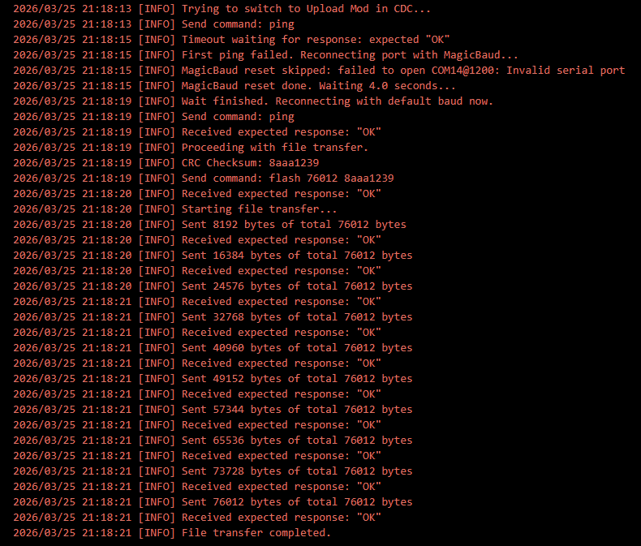
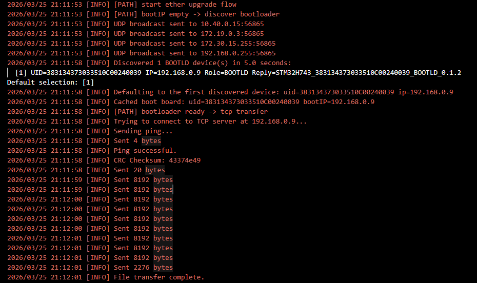

# open-plc

> **Setting up a machine to work on this project?** Read [CLAUDE.md](CLAUDE.md)
> instead: which repositories to clone, what to install, what to configure, and
> what is deliberately not in git. This README covers flashing the bootloader
> onto a board and the Arduino-side installation only.
>
> Behaviour, security model and verification status are documented in `docs/`,
> which is the single source for all three. Do not restate them here.

# Prerequisities (Win or Linux)
a- Download and install STM32-Cube IDE lastest [Link](https://www.st.com/en/development-tools/stm32cubeide.html)  
b- Download and install arduino ide lastest [Link](https://www.arduino.cc/en/software)  
c- Download STM32-Cube-FW-H7 (optional, STM32 samples) [link](https://www.st.com/en/embedded-software/stm32cubeh7.html)  

---
**Tips**  
There are two modes of the openplc:
- BootLoader mode: Be able to upload the arduino application to the device.  
- APP mode (default): Run the arduino application directly.  

There are three ways to stay in the UPLOAD mode:  
1. The running application asked for it, through the handoff record in SRAM4
   (`boot_handoff_t`, see `IAPServer/IAP_boot_handoff.c`). This replaced the older
   RTC-backup-register magic flag; the register is no longer consulted.
2. The address of `IAP_APP_ADDRESS` is empty
3. The address of `IAP_APP_ADDRESS` is not empty and the button `BOOT0` is pressed

---

# Download BootLoader-Menu to PLC-H743IIKx  
a- Clone the git repo  (ssh://git@git.schaeffer-ag.de/OpenPLC_Alpha/open_plc_cube_ide.git)  
b- Open the project using STM32Cube ide  
c- Compile the project  

  

d- Connect ST-LINK to JTAG socket on the board  

  

e- Connect the RS232 pins ( PC11 -> UART4_RX | PC10 -> UART4_TX) to the pc with the serial port converter cable    
    
f- Connect the device USB port to pc with USB cable (Arduino IDE will download bin file through this port)   

g- Connect the network cable between router and OpenPLC  

h- using Cube IDE, select Run -> open_plc_cube_ide   
 (If it is empty, click 'Run Configurations...' -> select 'open_plc_cube_ide' -> 'Run' )  
i- download file to the board  


---
**NOTE**  
- The PLC USB port will be recognized as : "/dev/ttyACMxx" in Ubuntu or "COMxx" in Windows. (xx for your own device number. For me,it is COM3 | /dev/ttyACM0)

---


# Download Applications using Arduino

a- add the following url to arduino > file > preferences (https://github.com/haliboteda/package_index_json/releases/download/v0.1.2/package_openplc_alp_index.json)  
*If you have already installed the package, Please remove it first and then follow the instruction.*  
***\**Please don't try to connect OpenPLC with serial monitor at baud rate 1200. Because it will cause the openplc keep rebooting.***  

  

  

b- open board manager and write in the search bar "PLC"  

  

c- Select the lastest version and press install  

  

d- after download, select the openplc board "OPEN-PLC" 

  

e1- You could select upload method "CDC Transfer" and select the OpenPLC CDC(usb) port "COM3 | /dev/ttyACM0"  

  

e2- Or You could select upload method "ETH Transfer"   

  

f- write your sketch  
```c
void setup() {
  // put your setup code here, to run once:
  pinMode(LED3_Pin, OUTPUT);
}

void loop() {
  // put your main code here, to run repeatedly:
  digitalWrite(LED3_Pin, HIGH);  // turn the LED on
  delay(1500);              // wait for a second
  digitalWrite(LED3_Pin, LOW);   // turn the LED off
  delay(500);               // wait for a second
}
```

g- __You don't need to do anything. The program will automatically copy the code into OpenPLC.__  
This is CDC Transfer log:  
  
This is ETH Transfer log:  
  

---
**FAQ**  
- In Linux, Arduino IDE need permission to open serial port. Please add use into user group "dialout".  
   (https://support.arduino.cc/hc/en-us/articles/360016495679-Fix-port-access-on-Linux)    
- There are some *.sh files in the Arduino package need permission to execute. Please give +x to them. (Replace {user name} and {package version} according to your environment )  
   `chmod +x "/home/{user name}/.arduino15/packages/OpenPLC_Alpha/hardware/stm32/{package version}/system/extras/prebuild.sh"`   
   `chmod +x "/home/{user name}/.arduino15/packages/OpenPLC_Alpha/hardware/stm32/{package version}/system/extras/postbuild.sh"`  
- The IAPTool needs permission to execute and save config infomation into the file local_config.json.  
   `chmod +x "/home/{user name}/.arduino15/packages/OpenPLC_Alpha/tools/STM32Tools/{package version}/linux/IAPTool"`    
- **When you have already uploaded the arduino bin file and then want to load into Upload mode again but you failed, Please reset the device and hold down the `BOOT0` button for 3-5 seconds when clicking. And then the device will stay in the Upload mode.**   
---
  

**Flash Constructure**  

  
