# open-plc
# Prerequisities (Win or Linux)
a- Download and install STM32-Cube IDE 1.10.0 [Link](https://www.st.com/en/development-tools/stm32cubeide.html)  
b- Download and install arduino ide [Link](https://www.arduino.cc/en/software)  
c- Download STM32-Cube-FW-H7 (optional, STM32 samples) [link](https://www.st.com/en/embedded-software/stm32cubeh7.html)  

# Download USB-DFU to PLC-H743IIKx  
a- Clone the git repo  
b- Open the project using Cube ide  
c- Compile the project  

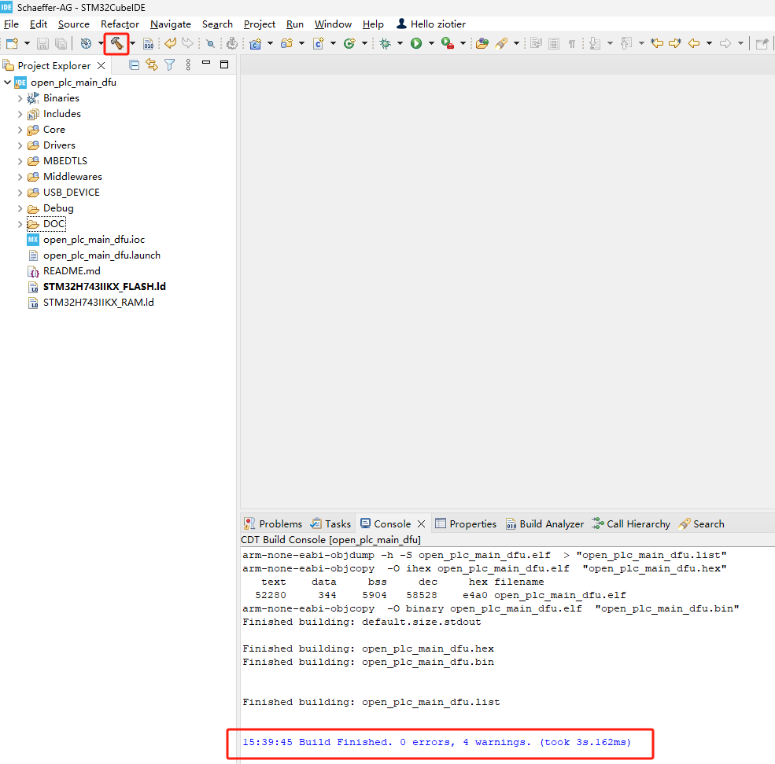  

d- Connect ST-LINK to JTAG socket on the board  

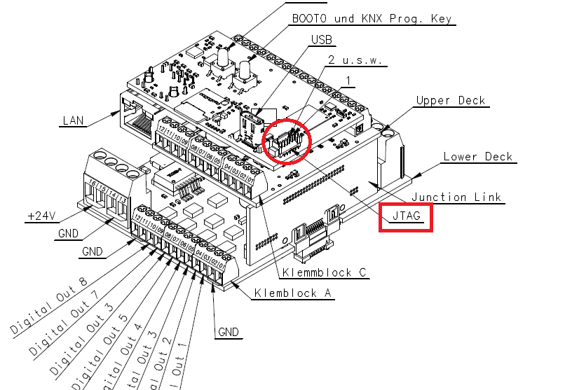  

e- Connect the RS232 pins to the pc with the serial port converter cable  
f- Connect the device to pc with usb cable  
g- open the serial monitor on the pc  
h- using Cube IDE, select Run -> open_plc_main_dfu , (If it is empty, click 'Run Configurations...' -> select 'open_plc_main_dfu' -> 'Run' )  
i- download file to the board  

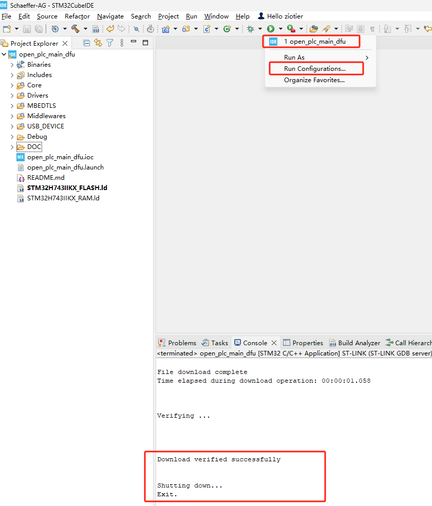

---
**NOTE**  
1- After download, you would see the selection menu on the serial monitor. Send "1" to the plc in 5 seconds.  

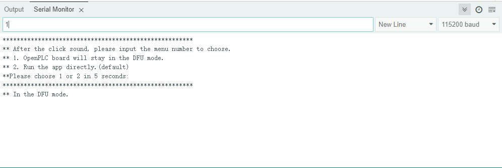

2- You should see at the device manager teh board as DFU device as following  

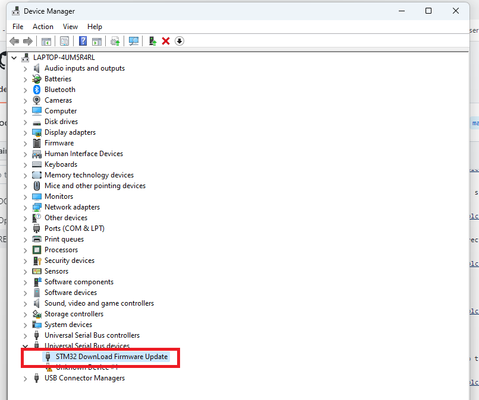

---


# Download Applications using Arduino

**Currently, You should download the json file firstly [Link](https://gitea.apps.cluster.schaeffer-ag.de/liu/open_plc_arduino/src/branch/master/package_open_plc_index.json)**
**Upload the json file to your local server**

a- add the following url to arduino > file > preferences (http://localhost/package_open_plc_index.json)  

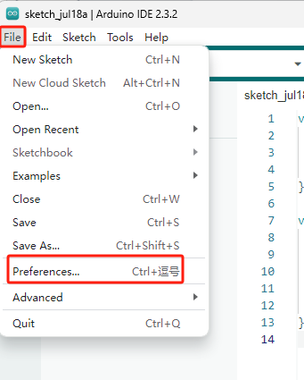  

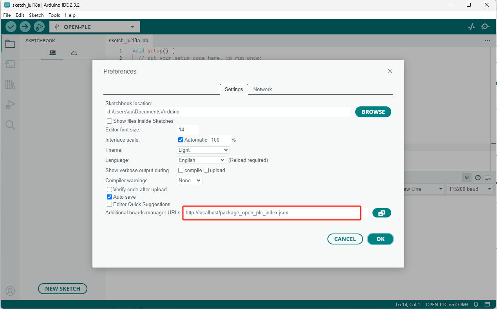  

b- open board manager and write in the search bar "PLC"  

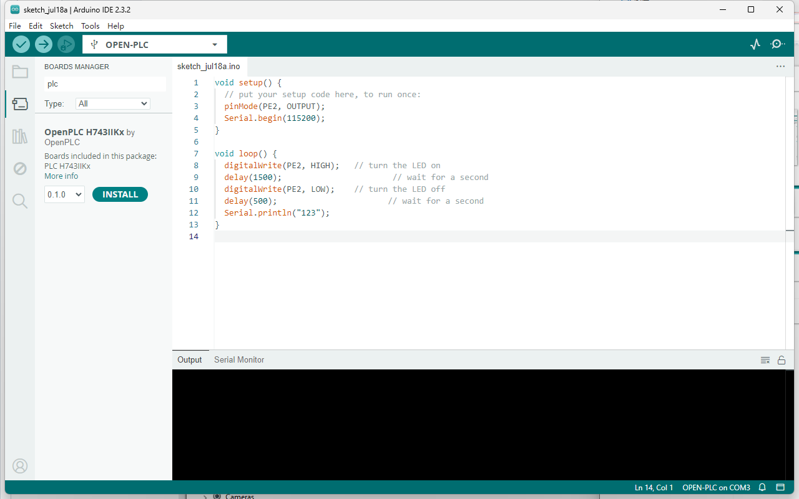  

c- Select the new version 0.1.0 and press install  

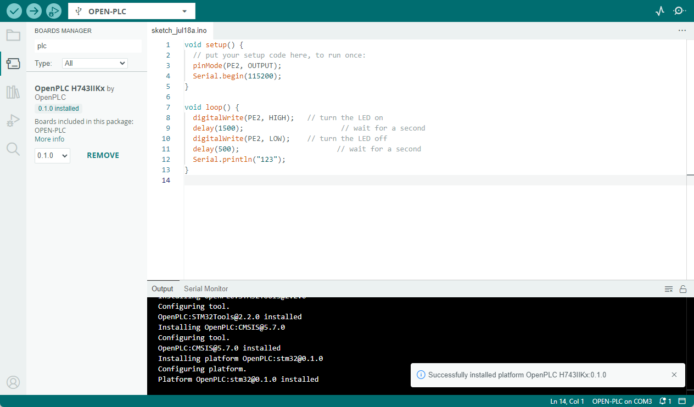  

d- after finishing the package download, select the openplc board  

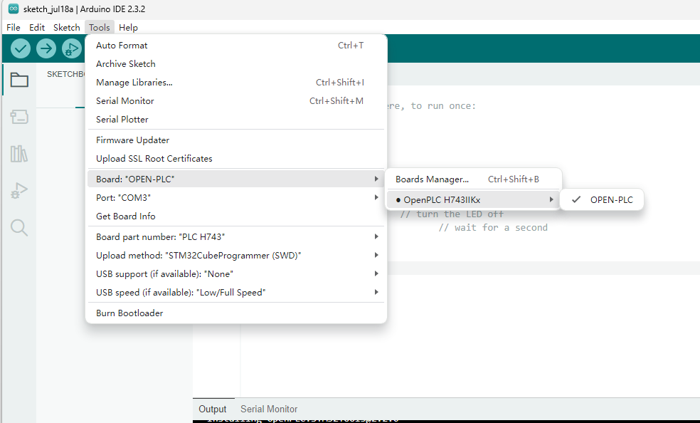  

e- select port number 'PLC H743' and upload method "DFUUtilUpload"  

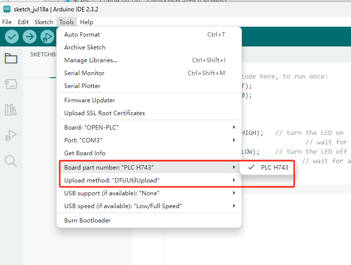  

f- write your sketch  
```c
void setup() {
  // put your setup code here, to run once:
  pinMode(B_REL_1, OUTPUT);
}

void loop() {
  // put your main code here, to run repeatedly:
  digitalWrite(B_REL_1, REL_OUTA);
  delay(1000);
  digitalWrite(B_REL_1, REL_OUTB);
  delay(1000);

}
```

---
**NOTE**  
1- If you select CDC support, the device will be recognized as CDC device.   
   If you select 'None', the device will not be seen.  

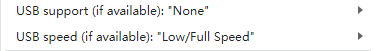  
---

g- Upload the code. After finished, press the 'RESET' button.  

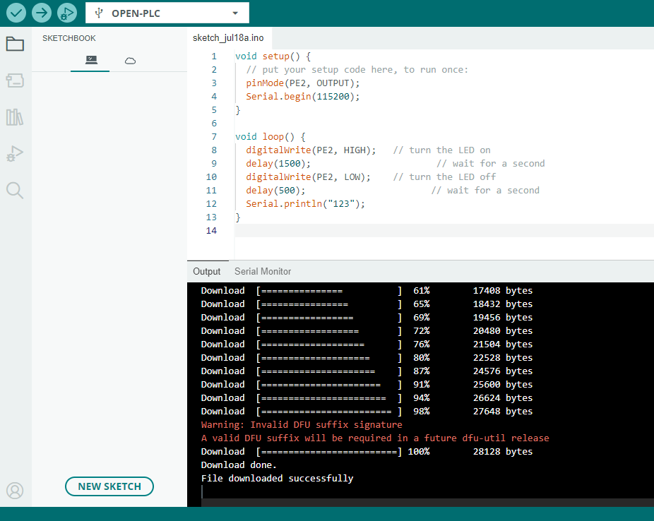  

h- After the device power on, there are 5 seconds to select the running mode. If you select '2' or nothing, device will directly run the application.  

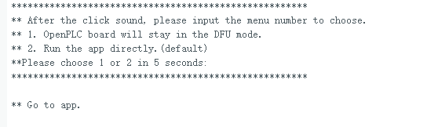  
