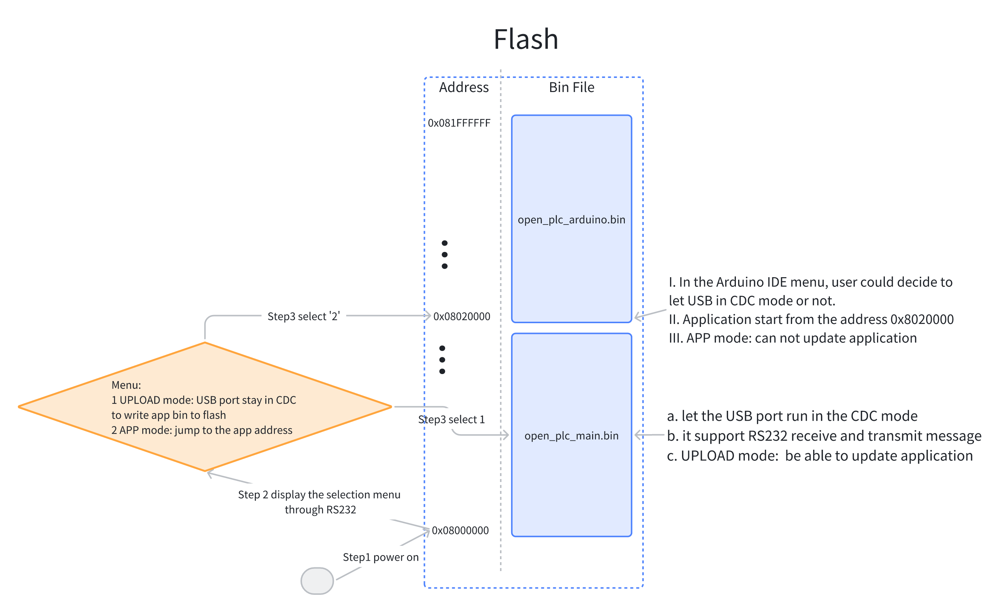

# open-plc
# Prerequisities (Win or Linux)
a- Download and install STM32-Cube IDE 1.16.1 [Link](https://www.st.com/en/development-tools/stm32cubeide.html)  
b- Download and install arduino ide 2.3.3 [Link](https://www.arduino.cc/en/software)  
c- Download STM32-Cube-FW-H7 (optional, STM32 samples) [link](https://www.st.com/en/embedded-software/stm32cubeh7.html)  

---
**Tips**  
There are two modes of the openplc:
- UPLOAD mode: Be able to update the application in the device.  
- APP mode (default): Run the application directly.  
After each restart, there is a 5-second window to choose the mode. If you missed, you have to restart the device.
---

# Download BootLoader-Menu to PLC-H743IIKx  
a- Clone the git repo  (https://gitea.apps.cluster.schaeffer-ag.de/OpenPLC_Alpha/open_plc_main_cdc.git)  
b- Open the project using STM32Cube ide  
c- Compile the project  

  

d- Connect ST-LINK to JTAG socket on the board  

  

e- Connect the RS232 pins ( PC11 -> UART4_RX | PC10 -> UART4_TX) to the pc with the serial port converter cable    
   (In Ubuntu it will be recognized as "/dev/ttyUSBxx" and in Windows it will be "COMxx": xx for your own device number. For me,it is COM5 | /dev/ttyUSB0)  
    
f- Connect the device USB port to pc with USB cable (Arduino IDE will download bin file through this port)   
  
g- open the serial monitor on the pc  
h- using Cube IDE, select Run -> open_plc_main_cdc   
 (If it is empty, click 'Run Configurations...' -> select 'open_plc_main_cdc' -> 'Run' )  
i- download file to the board  


---
**NOTE**  
1- After download and the device restarts, you would see the selection menu on the serial monitor.   
   Send "1" to the plc, with RS232 port (COM5 | /dev/ttyUSB0) in 5 seconds.  


2- The PLC will be recognized as : "/dev/ttyACMxx" in Ubuntu or "COMxx" in Windows. (xx for your own device number. For me,it is COM3 | /dev/ttyACM0)

---


# Download Applications using Arduino

a- add the following url to arduino > file > preferences (https://github.com/haliboteda/open_plc_arduino/releases/download/v0.1.0/package_openplc_alp_index.json)  

  

  

b- open board manager and write in the search bar "PLC"  

  

c- Select the new version 0.1.0 and press install  

  

d- after download, select the openplc board "OPEN-PLC" and select the serial port "COM3 | /dev/ttyACM0"  

  

e- select port number 'PLC H743' and upload method "CDC Transfer"  

  

f- write your sketch  
```c
void setup() {
  // put your setup code here, to run once:
  pinMode(LED3_Pin, OUTPUT);
}

void loop() {
  // put your main code here, to run repeatedly:
  digitalWrite(LED3_Pin, HIGH);  // turn the LED on
  delay(1500);              // wait for a second
  digitalWrite(LED3_Pin, LOW);   // turn the LED off
  delay(500);               // wait for a second
}
```

---
**NOTE**  
1- If you select CDC support, the device will be recognized as CDC device.   
   If you select 'None', the device will not be seen.  

  
---

g- Upload the code. After finished, press the 'RESET' button to restart the openplc.  

  

h- After the device power on, there are 5 seconds to select the running mode. If you select '2' or nothing, device will directly run the application.  

  

---  
**Linux FAQ**         

1- In Linux, Arduino IDE need permission to open serial port. Please add use into user group "dialout".  
   (https://support.arduino.cc/hc/en-us/articles/360016495679-Fix-port-access-on-Linux)    
2- There are some *.sh files in the Arduino package need permission to execute. Please give +x to them. (Replace {user name} and {package version} according to your environment )  
   chmod +x "/home/{user name}/.arduino15/packages/OpenPLC_Alpha/hardware/stm32/{package version}/system/extras/prebuild.sh"   
   chmod +x "/home/{user name}/.arduino15/packages/OpenPLC_Alpha/hardware/stm32/{package version}/system/extras/postbuild.sh"
   
---   
**Flash Constructure**  

  
